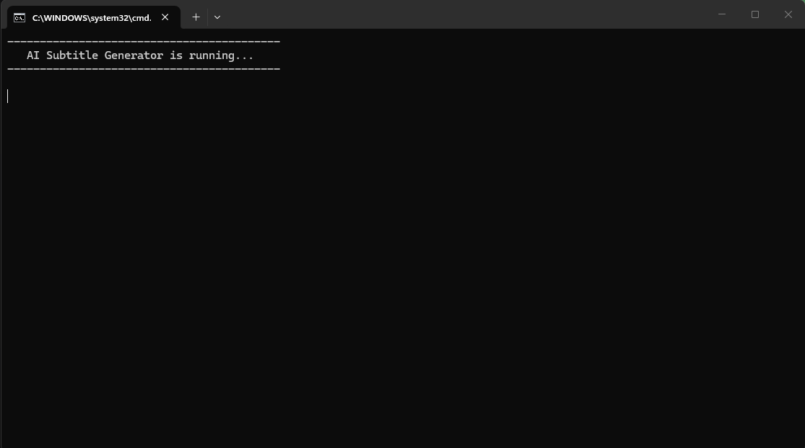
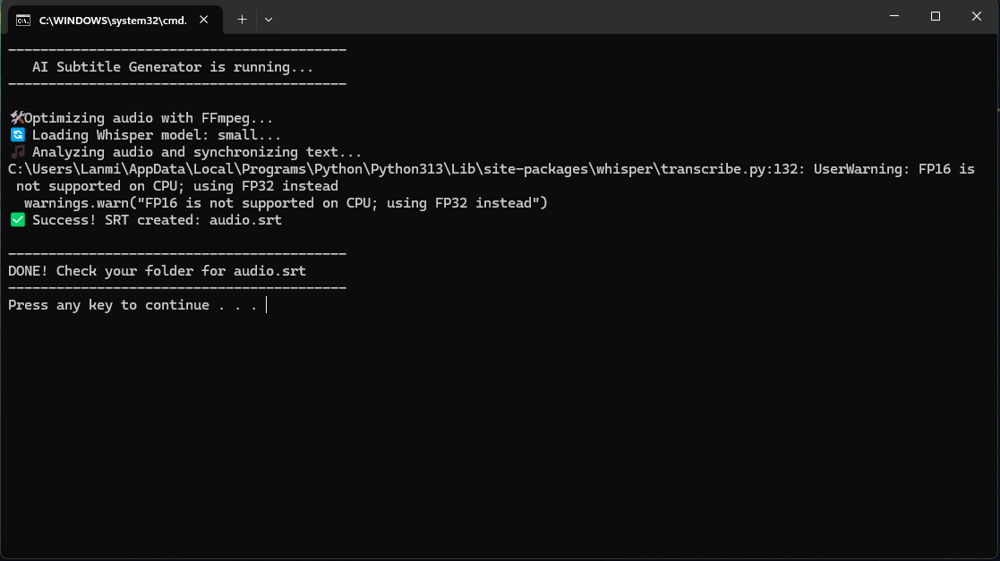

# 🎬 AI-Powered Shorts Subtitle Generator

An automated Python tool that generates **word-level SRT subtitles** for short-form video content (YouTube Shorts, TikTok, Reels).

## 🚀 Project Overview

I built this tool while learning **Python** to solve a real-world problem. My wife creates content for YouTube Shorts, and manual subtitling was taking hours of her time. I decided to automate the entire workflow using AI and scripting.

This project demonstrates my ability to:

- **Automate Workflows:** Turning a 1-hour manual task into a 10-second script.
- **Integrate AI Models:** Using OpenAI's Whisper for high-accuracy speech-to-text.
- **Process Media:** Leveraging FFmpeg for signal processing and audio conversion.

---

## 📸 Showcase

| 1. Launching the Script               | 2. Transcription Finished                 |
| ------------------------------------- | ----------------------------------------- |
|  |  |

---

## 🛠 Features

- **Word-Level Precision:** Captions appear word-by-word, matching the speaker's pace.
- **Script Sync:** Perfectly aligns the original script (`text.txt`) with audio timestamps.
- **Optimized for AI:** Automatically converts audio to 16kHz mono (Whisper's native format) using FFmpeg.
- **User-Friendly:** Includes a Windows `.bat` file for one-click execution.
- **Language Agnostic:** Supports 90+ languages (German, Serbian, English, etc.) via OpenAI Whisper.

## 📋 Prerequisites

Ensure you have the following installed:

- [Python 3.8+](https://www.python.org/downloads/)
- [FFmpeg](https://ffmpeg.org/download.html) (Added to your System PATH)
- [OpenAI Whisper](https://github.com/openai/whisper)

## 🔧 Quick Start

1. Clone the repository:
   ```bash
   git clone [https://github.com/Uzelac97/Shorts-Subtitle-Generator.git](https://github.com/Uzelac97/Shorts-Subtitle-Generator.git)
   cd Shorts-Subtitle-Generator
   ```
